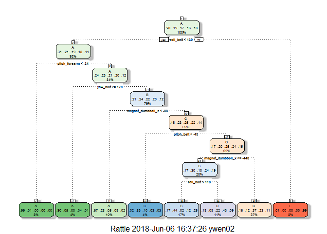
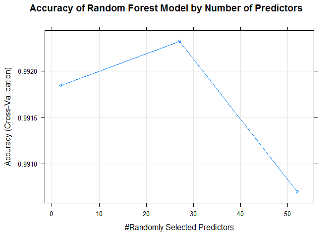
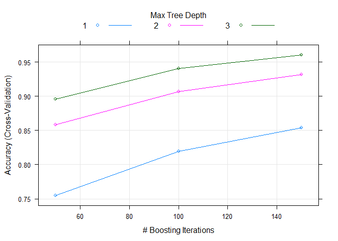

### Background and Data Load:
##### One thing that people regularly do is quantify how much of a particular activity they do, but they rarely quantify how well they do it. In this project, your goal will be to use data from accelerometers on the belt, forearm, arm, and dumbell of 6 participants.
The goal of your project is to predict the manner in which they did the exercise. This is the "classe" variable in the training set. The participants were each instructed to perform the exercise either properly (Class A) or in a way which replicated 4 common weightlifting mistakes (Classes B, C, D, and E).


```r
library(caret)
```

```
## Warning: package 'caret' was built under R version 3.4.4
```

```
## Loading required package: lattice
```

```
## Loading required package: ggplot2
```

```r
library(ggplot2)
library(rattle)
```

```
## Warning: package 'rattle' was built under R version 3.4.4
```

```
## Rattle: A free graphical interface for data science with R.
## Version 5.1.0 Copyright (c) 2006-2017 Togaware Pty Ltd.
## Type 'rattle()' to shake, rattle, and roll your data.
```

```r
set.seed(12345)
training <- read.csv(url("https://d396qusza40orc.cloudfront.net/predmachlearn/pml-training.csv"), header=TRUE)
testing <-read.csv(url("https://d396qusza40orc.cloudfront.net/predmachlearn/pml-testing.csv"),header=TRUE)
```

*** Data Explore

```r
dim(training)
str(training)
```

```r
table(colSums(is.na(training))/length(training$user_name))
```

```
## 
##                 0 0.979308938946081 
##                93                67
```
By glancing the data, I notice that the first 7 columns are the user and exercise time info. This is not related to what we are trying to predict. So I will remove it from the data. 
Also, I notice there are 67 columns have 97% of the data is NA or blank. I will exclude these columns too.

```r
NAremoveColumn <- which(colSums(is.na(training)|training=="" )>0.9*dim(training)[1])
trainingClean <- training[,-NAremoveColumn]
trainingCleanFinal <- trainingClean[,-c(1:7)]


NAremoveColumn <- which(colSums(is.na(testing)|testing=="")>0.9*dim(training)[1]) 
testingClean <- testing[,-NAremoveColumn]
testingCleanFinal <- testing[,-c(1:7)]

dim(trainingCleanFinal)
```

```
## [1] 19622    53
```

```r
dim(testingCleanFinal)
```

```
## [1]  20 153
```

I want to split the training set one more time to train and test set. This way we can validate different models and did not use the final test set until the very end. 

```r
set.seed(12345)
inTrain <- createDataPartition(trainingCleanFinal$classe, p=0.75, list=FALSE)
train1<-  trainingCleanFinal[inTrain,]
test1 <- trainingCleanFinal[-inTrain,]
```

#### This is a classification predict problem. In the following sections, we will test 3 different models : classification tree, random forest and gradient boosting method.

n order to limit the effects of overfitting, and improve the efficicency of the models, we will use the *cross-validation technique. We will use 5 folds 

#### 1. Decision Tree


```r
trControl <- trainControl(method="cv", number=5)
modFit_tree <- train(classe ~.,data= train1, method="rpart", trControl=trControl)
fancyRpartPlot(modFit_tree$finalModel)
```

<!-- -->

```r
testpred <- predict(modFit_tree,newdata=test1)
confusionMatrix <- confusionMatrix(test1$classe,testpred)
confusionMatrix$overall
```

```
##       Accuracy          Kappa  AccuracyLower  AccuracyUpper   AccuracyNull 
##   5.415987e-01   4.244770e-01   5.275299e-01   5.556179e-01   3.699021e-01 
## AccuracyPValue  McnemarPValue 
##  1.365836e-131  7.169181e-223
```

We notice that the accuary of this model is only around 54%. This means almost half of the time new classe prediction will be wrong.

#### 2. Random Forest 

```r
modFit_RF <- train(classe ~., data=train1, method="rf", trControl=trControl,verbose=FALSE)
print(modFit_RF)
```

```
## Random Forest 
## 
## 14718 samples
##    52 predictor
##     5 classes: 'A', 'B', 'C', 'D', 'E' 
## 
## No pre-processing
## Resampling: Cross-Validated (5 fold) 
## Summary of sample sizes: 11776, 11775, 11773, 11774, 11774 
## Resampling results across tuning parameters:
## 
##   mtry  Accuracy   Kappa    
##    2    0.9918466  0.9896855
##   27    0.9923226  0.9902884
##   52    0.9906918  0.9882252
## 
## Accuracy was used to select the optimal model using the largest value.
## The final value used for the model was mtry = 27.
```

```r
plot(modFit_RF,main="Accuracy of Random Forest Model by Number of Predictors")
```

<!-- -->

```r
testpred <- predict(modFit_RF,newdata=test1)
confusionMatrix <- confusionMatrix(test1$classe,testpred)
confusionMatrix$overall
```

```
##       Accuracy          Kappa  AccuracyLower  AccuracyUpper   AccuracyNull 
##      0.9930669      0.9912298      0.9903250      0.9951940      0.2854812 
## AccuracyPValue  McnemarPValue 
##      0.0000000            NaN
```

```r
MostImpVars <- varImp(modFit_RF)
MostImpVars
```

```
## rf variable importance
## 
##   only 20 most important variables shown (out of 52)
## 
##                      Overall
## roll_belt             100.00
## pitch_forearm          57.90
## yaw_belt               56.86
## magnet_dumbbell_z      44.51
## pitch_belt             44.02
## magnet_dumbbell_y      40.55
## roll_forearm           39.56
## accel_dumbbell_y       21.11
## magnet_dumbbell_x      17.90
## roll_dumbbell          17.68
## accel_forearm_x        17.27
## magnet_belt_z          14.44
## accel_dumbbell_z       14.16
## magnet_forearm_z       14.08
## total_accel_dumbbell   13.45
## magnet_belt_y          12.82
## accel_belt_z           12.02
## yaw_arm                11.39
## gyros_belt_z           10.48
## magnet_belt_x          10.18
```
For random forest, the accury is around 99%, which is very good. But from the graph above we can see that the number of predictors for the highest accury is 27. This suggest that there are some dependence between the predictors.At the end, varImp give us 20 most important variables.

#### 3.Gradient Boosting Method

```r
modFit_GBM <- train(classe~., data=train1, method="gbm", trControl=trControl, verbose=FALSE)
print(modFit_GBM)
```

```
## Stochastic Gradient Boosting 
## 
## 14718 samples
##    52 predictor
##     5 classes: 'A', 'B', 'C', 'D', 'E' 
## 
## No pre-processing
## Resampling: Cross-Validated (5 fold) 
## Summary of sample sizes: 11775, 11775, 11774, 11773, 11775 
## Resampling results across tuning parameters:
## 
##   interaction.depth  n.trees  Accuracy   Kappa    
##   1                   50      0.7547203  0.6891712
##   1                  100      0.8194732  0.7714678
##   1                  150      0.8541930  0.8154916
##   2                   50      0.8585420  0.8207615
##   2                  100      0.9064419  0.8816012
##   2                  150      0.9317853  0.9136787
##   3                   50      0.8959101  0.8682235
##   3                  100      0.9406855  0.9249385
##   3                  150      0.9605249  0.9500546
## 
## Tuning parameter 'shrinkage' was held constant at a value of 0.1
## 
## Tuning parameter 'n.minobsinnode' was held constant at a value of 10
## Accuracy was used to select the optimal model using the largest value.
## The final values used for the model were n.trees = 150,
##  interaction.depth = 3, shrinkage = 0.1 and n.minobsinnode = 10.
```

```r
plot(modFit_GBM)
```

<!-- -->

```r
testpred <- predict(modFit_GBM,newdata=test1)
confusionMatrix <- confusionMatrix(test1$classe,testpred)
confusionMatrix$overall
```

```
##       Accuracy          Kappa  AccuracyLower  AccuracyUpper   AccuracyNull 
##      0.9622757      0.9522608      0.9565588      0.9674334      0.2895595 
## AccuracyPValue  McnemarPValue 
##      0.0000000            NaN
```

We can see that the random forest have the highest accuray 99%, then gradient boosting, around 95%. Decision tree has the lowest 55%.

### Conclusion:
We will use the random forest model to predict classe in the test set.

```r
FinalTestPred <- predict(modFit_RF,newdata=testingCleanFinal)
FinalTestPred
```

```
##  [1] B A B A A E D B A A B C B A E E A B B B
## Levels: A B C D E
```
